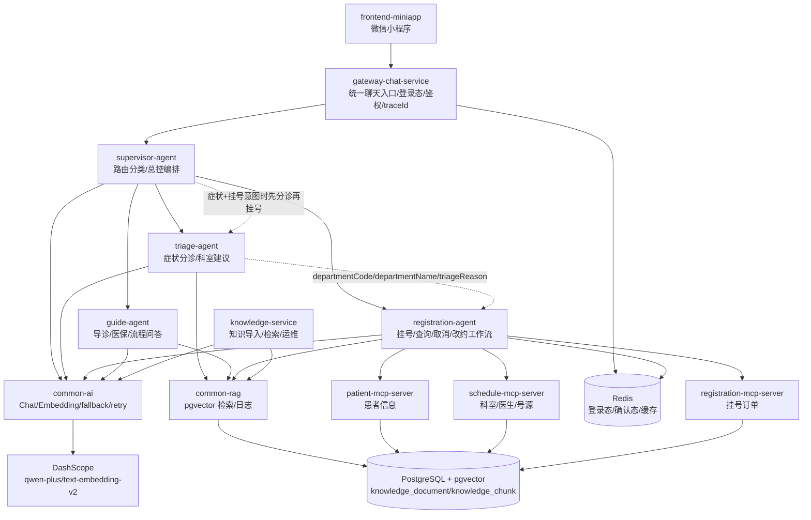

# Ai-SmartClinic 统一架构与后续开发计划

日期：2026-05-02

这份文档是当前唯一主架构文档，合并了原来的项目路线图和 A2A 升级方案。前半部分描述已经落地的系统架构，后半部分描述后续怎么继续开发。

## 1. 当前项目定位

Ai-SmartClinic 的目标不是单机 Demo，而是一个可运行、可扩展、可观测、可演进的智能挂号与院内导诊系统。

核心能力包括：

- 微信小程序作为用户入口。
- `gateway-chat-service` 作为统一聊天入口，负责登录态、鉴权、traceId 和请求转发。
- `supervisor-agent` 作为总控路由和轻量编排层。
- `triage-agent`、`registration-agent`、`guide-agent` 分别负责分诊、挂号工作流和导诊问答。
- `patient-mcp-server`、`schedule-mcp-server`、`registration-mcp-server` 负责确定性业务能力和数据访问。
- `common-ai` 统一封装 LLM、Embedding、fallback、retry 和模型异常分类。
- `common-rag` 统一封装 pgvector 检索、知识导入、检索日志和 RAG 基础结构。
- `knowledge-service` 负责知识导入、检索、运维查询、文档启停和检索验收。
- PostgreSQL 承载业务数据，pgvector 承载统一知识库，Redis 承载登录态、确认态和缓存。

当前聊天模型已切回阿里 DashScope，默认走 `qwen-plus`。Embedding 使用 DashScope `text-embedding-v2`，当前实测与数据库统一为 1536 维。

## 2. 总体架构图



## 3. 请求链路

### 3.1 普通聊天入口

```text
frontend-miniapp
 -> gateway-chat-service
 -> supervisor-agent
 -> triage-agent / registration-agent / guide-agent
 -> MCP servers / common-rag / common-ai
 -> PostgreSQL / pgvector / Redis
```

`gateway-chat-service` 是聊天入口，但它不负责业务判断；业务路由由 `supervisor-agent` 完成。

### 3.2 分诊后挂号编排

当用户同时表达症状和挂号意图，例如“发烧咳嗽想挂号”，链路是：

```text
gateway-chat-service
 -> supervisor-agent
 -> triage-agent
 -> supervisor-agent 汇总 triage 结果
 -> registration-agent
 -> patient/schedule/registration MCP
 -> registration-agent 返回挂号预览或确认结果
```

这个链路已经落地。`triage-agent` 只负责科室建议和安全提示；真实号源、就诊人、订单状态仍然由 `registration-agent` 调 MCP 和数据库决定。

### 3.3 RAG 检索链路

```text
知识源
 -> knowledge-service /api/knowledge/ingest
 -> chunk
 -> common-ai embedding
 -> knowledge_document / knowledge_chunk
 -> agent 检索 common-rag
 -> pgvector topK
 -> evidence 拼入 prompt
 -> LLM 生成结构化或自然语言结果
 -> 后端规则校验和业务兜底
```

当前统一知识表：

- `knowledge_document`
- `knowledge_chunk`
- `knowledge_ingest_job`
- `knowledge_retrieval_log`

当前已经导入的 baseline namespace：

- `default-triage-knowledge`
- `default-guide-knowledge`
- `default-registration-policy`

## 4. 模块职责

### 4.1 frontend-miniapp

负责微信登录、token 保存、用户输入、结果展示、挂号入口和预约记录展示。

前端不直接做核心业务判断，不直接调用模型，不直接访问业务数据库。

### 4.2 gateway-chat-service

职责：

- 微信登录换取用户身份。
- token 生成、校验和 Redis 缓存。
- traceId 生成和透传。
- 聊天请求转发到 `supervisor-agent`。

后续它应该继续保持薄入口定位，不要把分诊、挂号和导诊规则塞回 gateway。

### 4.3 supervisor-agent

职责：

- 意图路由：`TRIAGE`、`REGISTRATION`、`GUIDE`、`HUMAN_REVIEW`。
- 规则优先 + LLM 结构化分类。
- 必要时编排多个 agent。
- 目前已支持“先分诊再挂号”的轻量编排。
- 通过 `AgentRegistry` 管理 domain agent endpoint 和 capability 快照。

它不直接查号源，不直接创建订单，不直接替代业务 agent 的领域判断。

### 4.4 triage-agent

职责：

- 识别症状和急症红线。
- 检索 `default-triage-knowledge`。
- 结合规则、RAG evidence 和 LLM 输出科室建议。
- 返回 `departmentCode`、`departmentName`、`emergency`、`reason` 等结构化结果。

原则：

- 医疗安全红线保留在后端规则中。
- 普通科室知识进入 RAG，不继续大量写死在 Java 里。
- 低置信度或急症场景必须兜底。

### 4.5 registration-agent

职责：

- 识别挂号意图：创建、查询、取消、改约。
- 槽位提取：科室、医生、日期、时间、订单号等。
- 调用 MCP 查询患者、号源和订单。
- 执行 preview -> confirmation -> write action。
- 使用 Redis 保存确认上下文。
- 使用 `default-registration-policy` 补充挂号规则解释和风险提示。

原则：

- LLM 不能编造真实号源、医生、订单状态和支付退费结果。
- 真实业务状态必须来自 MCP/PostgreSQL。
- 写操作必须有确认态和幂等上下文。

### 4.6 guide-agent

职责：

- 院内导诊问答。
- 医保材料、到院流程、签到、取消改约说明、检查检验、报告查询等。
- 检索 `default-guide-knowledge`，用 evidence 约束回复。

原则：

- 没有 evidence 时只能给通用建议，不编造院内规则。
- 急症描述要优先安全提示。

### 4.7 MCP servers

职责：

- `patient-mcp-server`：患者信息。
- `schedule-mcp-server`：科室、医生、排班、号源。
- `registration-mcp-server`：挂号订单、查询、取消、改约。

MCP 是确定性工具层，不负责生成聊天回复，也不承载 agent 状态机。

### 4.8 common-ai

职责：

- Chat 模型调用。
- Embedding 模型调用。
- fallback 模型切换。
- transient retry。
- 模型异常分类。
- 基础模型调用日志。

不要放入：

- 业务 prompt。
- 分诊规则。
- 挂号工作流。
- 院内政策。

### 4.9 common-rag

职责：

- 统一 pgvector 检索。
- RAG 检索状态和日志。
- 知识导入核心逻辑。
- 简单文本切片。
- embedding 维度守卫。
- 检索 hit 和 metadata 标准结构。

当前已修复：

- `text-embedding-v2` 按 1536 维入库。
- 导入时如果 embedding 实际维度和配置不一致，会明确失败并记录 ingest job。
- RAG hit attributes 允许 metadata 投影为空，避免通用检索接口因为 null 失败。

### 4.10 knowledge-service

职责：

- `POST /api/knowledge/ingest`：导入知识。
- `POST /api/knowledge/search`：通用知识检索验收。
- `GET /api/knowledge/jobs`：查看导入任务。
- `GET /api/knowledge/documents`：查看知识文档。
- `POST /api/knowledge/documents/{documentId}/status`：启停/归档文档，并同步 chunk enabled。
- `GET /api/knowledge/chunks`：查看 chunk。
- `GET /api/knowledge/retrieval-logs`：查看检索日志。

它现在是 RAG 运维入口，不再只是一个导入接口。

## 5. 当前已经完成的关键节点

### 5.1 多 Agent 主链路

已完成：

- gateway -> supervisor -> domain agent 的主链路。
- supervisor 基于规则 + LLM 做路由。
- supervisor 对症状挂号场景支持 triage -> registration 编排。
- registration-agent 已有 preview/confirmation/write workflow。
- MCP 服务承载确定性业务能力。

### 5.2 AI 配置

已完成：

- Chat 默认恢复为阿里 DashScope `qwen-plus`。
- Embedding 默认统一为 DashScope `text-embedding-v2`。
- Embedding 维度统一为 1536。
- `common-ai` 支持 fallback/retry/model route。

### 5.3 RAG 基建

已完成：

- 统一知识表 schema。
- triage/guide/registration-policy 均切到统一 `knowledge_chunk`。
- `knowledge-service` 支持导入、检索、管理和日志查询。
- baseline 知识已导入。
- 新增 RAG 检索验收脚本：

```text
database/verify/2026-05-02-verify-rag-retrieval.ps1
```

该脚本已验证三个 namespace 都能命中。

### 5.4 A2A-lite 基础

已完成：

- `common-agent` 已有基础 envelope/workflow/capability 类型。
- triage/registration/guide 已暴露统一 `POST /api/agent/execute` contract。
- triage/registration/guide 已暴露 `GET /api/agent/capabilities`。
- supervisor 默认通过统一 execute contract 调用 domain agent，并保留旧接口 fallback。
- supervisor 已新增 `AgentRegistry`，启动后会尝试加载各 agent capability。

## 6. 当前仍然不成熟的地方

### 6.1 Agent Registry 还没有完全平台化

当前 agent 协议已经统一为：

```text
POST /api/agent/execute
GET  /api/agent/capabilities
```

但 supervisor 仍然通过 `app.agents.*.base-url` 配置固定的 triage/registration/guide 地址。
后续要继续把 registry 做成更完整的平台能力，包括动态注册、health 状态、版本、权重和按 capability 路由。

### 6.2 上下文传递还不够标准

当前已经有 `traceId/chatId/userId/metadata`，但还需要标准化：

- route reason
- model meta
- RAG hit summary
- tool call summary
- confirmation context
- workflow state
- fallback reason

### 6.3 RAG 还缺企业级数据治理

现在已经有统一表、导入、检索、日志和启停，但还需要：

- 更正式的文档解析。
- 知识源版本发布流程。
- 评估集和自动评分。
- 权限边界。
- 数据质量校验。
- 更完整的回滚和审计。

### 6.4 workflow runtime 还没有抽象成平台能力

registration-agent 自己已经有工作流，但 common-agent 还没有真正成为可执行 runtime。

后续应先在 registration-agent 试点，把 preview/confirmation/write/compensation 这些能力沉淀成轻量 workflow runtime。

## 7. 后续开发计划

下面按优先级执行，不建议一上来引入新框架重写。

### Phase 1：补齐 Agent 标准协议

状态：已完成。

目标：让所有 agent 都有统一输入输出 contract。

要做：

1. 定义最终版 `AgentRequestEnvelope`。
2. 定义最终版 `AgentResponseEnvelope`。
3. 定义 `AgentExecutionMeta` 字段规范。
4. triage/registration/guide 暴露 `POST /api/agent/execute`。
5. 保留旧接口，旧接口内部适配新 envelope，避免一次性破坏前端和测试。

验收标准：

- supervisor 可以用同一套 client 调三个 domain agent。
- traceId/chatId/userId/metadata 在所有 agent 中一致。
- 每个 response 都能看到 agentName、latency、model、fallback、rag summary。

### Phase 2：给 supervisor 增加 AgentRegistry

状态：已完成当前阶段。当前已完成本地 registry、capability 加载、统一 client 动态调用和 triage -> registration handoff metadata schema。

目标：让 supervisor 不再硬编码每个 agent 的能力和地址。

要做：

1. 新增 `AgentRegistry`。
2. 每个 agent 暴露 `GET /api/agent/capabilities`。
3. supervisor 启动时加载 agent capability。
4. 路由结果从 `AgentRoute` 扩展为更完整的 `RouteDecision`：
   - targetAgent
   - confidence
   - reason
   - requiredSlots
   - handoffMetadata
   - safetyLevel
5. supervisor 普通单 agent 调用通过 `agentClient.call(route, request)` 进入 registry，不再在 orchestrator 里维护 triage/registration/guide 分支。
6. triage -> registration 交接 metadata 增加统一 `handoff.*` schema，同时保留 registration-agent 现有兼容字段。

验收标准：

- 新增 agent 不需要改 supervisor 大量 switch。
- supervisor 日志能说明为什么路由到某个 agent。
- triage -> registration 的 handoff metadata 有统一 schema。

### Phase 3：补 RAG 企业级知识治理

目标：把当前可用的 RAG 做成可持续维护的知识平台。

要做：

1. 完善 knowledge-service 的导入 job 生命周期：
   - PENDING
   - RUNNING
   - SUCCEEDED
   - FAILED
   - PARTIALLY_FAILED
2. 增加知识源版本发布模型：
   - draft
   - active
   - archived
3. 增加文档解析器接口：
   - Markdown
   - TXT
   - PDF 后续再接
   - DOCX 后续再接
4. 增加 RAG 评估集：
   - triage 50 条
   - guide 30 条
   - registration policy 30 条
5. 增加自动评估脚本：
   - expected namespace
   - expected metadata
   - expected topK hit
   - score threshold
6. 检索日志增加聚合统计：
   - hit rate
   - empty result rate
   - retrieval error rate
   - avg latency
   - best score distribution

验收标准：

- 换模型或换维度时能立刻被守卫发现。
- 知识导入失败不会污染 active 知识。
- 每次改知识或改 embedding，都能跑评估脚本给出结果。

### Phase 4：registration-agent 工作流 runtime 化

目标：先把最复杂的挂号流程抽象成可恢复、可审计、可补偿的轻量 workflow。

要做：

1. 从 create registration 开始抽象 workflow node：
   - classify intent
   - extract slots
   - fetch patient
   - resolve slot
   - preview
   - wait confirmation
   - reserve slot
   - create order
   - compensate release slot
2. 引入 checkpoint：
   - confirmationId
   - currentNode
   - input snapshot
   - tool result snapshot
3. 把 Redis confirmation context 扩展成 workflow checkpoint。
4. 增加 workflow execution log 表或 Redis+PostgreSQL 混合存储。

验收标准：

- 用户确认后可以从 checkpoint 恢复，而不是重新猜测上下文。
- 创建订单失败时能明确知道是否需要释放号源。
- 每个挂号请求都有完整 workflow trace。

### Phase 5：MCP 和业务数据增强

目标：让业务链路更接近真实医院系统，而不是只跑通 demo 数据。

要做：

1. 给 patient/schedule/registration MCP 增加更完整的数据库初始化脚本。
2. 增加号源锁定/释放的幂等字段。
3. 增加订单状态流转校验：
   - BOOKED
   - CANCELLED
   - RESCHEDULED
   - EXPIRED
4. 增加跨科室改约、过号、已签到、已支付等规则。
5. 增加 MCP 层审计日志。

验收标准：

- 重复提交不会重复创建订单。
- 取消/改约有清晰状态边界。
- MCP 返回结构能支撑 agent 做可靠回复。

### Phase 6：可观测性和运维

目标：能定位线上问题。

要做：

1. 全链路 traceId 打通：
   - gateway
   - supervisor
   - domain agent
   - MCP
   - RAG
   - LLM
2. 统一结构化日志字段。
3. 增加 actuator health 分组。
4. 增加核心指标：
   - route latency
   - model latency
   - RAG latency
   - MCP latency
   - confirmation timeout count
   - order success rate
5. knowledge-service admin token 在生产环境必须开启。

验收标准：

- 一条用户请求可以从 gateway 查到最终 MCP/LLM/RAG 结果。
- RAG 失败、模型失败、MCP 失败都有可识别日志和指标。

### Phase 7：部署和交付

目标：让项目能被稳定启动和展示。

要做：

1. Docker Compose：
   - PostgreSQL + pgvector
   - Redis
   - Nacos 可选
   - backend services
2. 数据初始化：
   - schema
   - MCP mock business data
   - baseline RAG knowledge
3. 一键验收脚本：
   - health check
   - RAG retrieval check
   - gateway chat smoke
   - registration create preview smoke
4. README 更新：
   - 架构图
   - 启动步骤
   - env 配置
   - 验收命令
   - 常见问题

验收标准：

- 新环境能按文档启动。
- 跑完验收脚本能证明主链路可用。
- 项目可以作为简历/面试/作品集交付材料。

## 8. 不建议现在做的事

当前不建议：

1. 直接全量引入 LangGraph 重写 Java 主链路。
2. 把业务 prompt 收进 `common-ai`。
3. 把分诊和挂号规则收进 `common-agent`。
4. 把 Redis 当主向量库。
5. 把 RAG 退回轻量缓存或关键词模拟。
6. 让 LLM 直接决定真实订单状态。
7. 在 agent 协议没有统一前强行接外部 A2A adapter。

如果后续要试 LangGraph，建议只在 `registration-agent` 的 create/cancel workflow 做 POC，不要改动主链路。

## 9. 下一步最具体的执行顺序

近期建议按这个顺序做：

1. 给三个 domain agent 增加统一 `/api/agent/execute` 适配层。
2. 改造 supervisor 的 `AgentClient`，先支持统一 envelope，同时保留旧 endpoint fallback。
3. 增加 `GET /api/agent/capabilities` 和 `AgentRegistry`。
4. 把 triage -> registration handoff metadata 标准化。
5. 扩充 RAG 评估集，从 3 条 smoke 扩到 100 条左右。
6. 给 knowledge-service 增加版本发布/回滚语义。
7. 抽象 registration-agent 的 workflow checkpoint。
8. 做 Docker Compose 和一键验收。

这条路线的核心原则是：先把已有系统标准化、可观测化、可评估化，再考虑外部 A2A 兼容和更复杂 workflow runtime。
